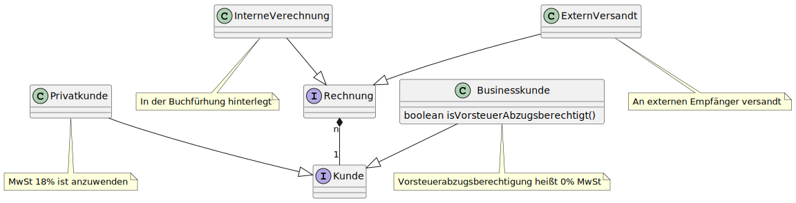

# DataOrientedJava

In diesem Repository befindet sich ein kleines Beispiel in dem ich die Prinzipien des Data Oriented Programmings mit
Java 19+ und Preview Features demonstriere.
Dieses Beispiel verwende ich in Artikeln und Vorträgen zu dem Themenblock und werde es regelmäßig auf die neusten
Versionen von Java aktualisieren.

## Das Beispiel: RechnungenErstellen

In diesem Beispiel erstelle ich für verschiedene Arten von Kunden Rechnungen.
Kunden unterteilen sich in Privat- und Businesskunden, wobei
Businesskunden [Vorsteuerabzugsberechtigt](https://buchhaltungslexikon.de/lexikon/vorsteuerabzugsberechtigt/) sein
können.

Zusätzlich gibt es zwei Rechnungsarten: intern und extern.
Bei internen Rechnungen handelt es sich um Verrechnungen zu denen keine Rechnung im herkömmlichen Sinne versandt werden
muss.
Bei externen Rechnungen muss die Rechnung formatiert und als E-Mail an den Kunden versandt werden.

## Enthalten in dem aktuellen Stand

1. [JEP 409: Sealed Classes](https://openjdk.java.net/jeps/409) um die Auswahlmöglichkeiten bei der Rechnung und dem
   Kunden zu modellieren
2. [JEP 395: Records](https://openjdk.org/jeps/395) um kompakte Data Carrier für Rechnungen und Kunden zu definieren
3. [JEP 394: Pattern Matching for instanceof](https://openjdk.org/jeps/394) um eine Fallunterscheidung zu machen wie ein
   Kunde bzw. eine Rechnung verarbeitet wird
4. [JEP 433: Pattern Matching for switch (Fourth Preview)](https://openjdk.org/jeps/433) um die Fallunterscheidung
   lesbarer zu machen
5. [JEP 432: Record Patterns (Second Preview)](https://openjdk.org/jeps/432) um direkt auf Record Inhalte zuzugreifen
6. [JEP 430: String Templates (Preview)](https://openjdk.org/jeps/430) um Texte noch besser angenehm zu formatiere
